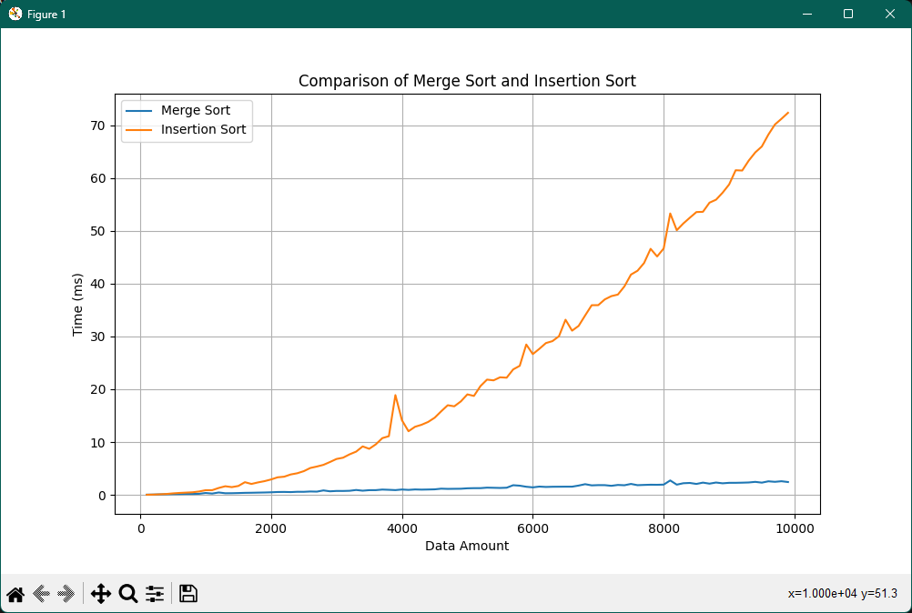

# Project Name

Sorting algorithm prject for TAMK course

## Grade target
This project is targetting the grade 5 as described in the project requirements

## How to Run
To run the project, you can use the Makefile or g++

### Using Makefile
1. Open a terminal and navigate to the project directory.
2. Run the following command to build the project:
    ```bash
    make
    ```
3. Once the project is built, you can run it using the following command:
    ```bash
    make run
    ```

### Visualizations
1. Uncomment the file ouput lines from tests.h
2. Navigate to the data folder with your terminal
3. Install the requirements:
    ```bash
    pip install -r requirements.txt
    ```
4. Run the plot:
    ```bash
    python visualize.py
    ```

## Screenshot


## Author
Vilho Mäkeläinen